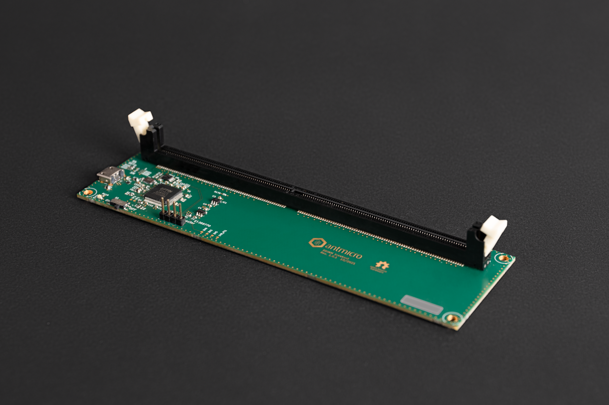

=======================
DDR4 SPD Breakout Board
=======================

Copyright (c) 2022 `Antmicro <https://www.antmicro.com>`_

Overview
--------

This repository contains open hardware design files for an experimental breakout board which allows reading the Serial Presence Detect (SPD) data from a 288-pin, JEDEC-compliant DDR4 DIMM module.  

The board includes a FT2232HL USB/UART converter with MPSSE which can read DIMM-content over I2C.
This board can be used with our `SPD Data Reader <https://github.com/antmicro/spd-data-reader>`_ software.

Repository structure
--------------------
The main repository directory contains KiCad PCB project files, a LICENSE and README.
The remaining files are stored in the following directories:

* ``lib`` - contains the component libraries
* ``img`` - contains graphics for this README

License
=======

`Apache-2.0 <LICENSE>`_
